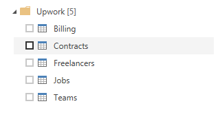

Introduction
============

The purpose of this **Power BI Custom Data Connector** is to connect to Upwork API and
pull data related to freelance projects. This custom data connector comes pre-packaged with a **Power BI Report** file to analyze your data quickly.

The custom connector and Power BI Report template files are available under "dist" folder.

The connector pulls following data from Upwork API:

1.  Teams

2.  Jobs (including sub-teams)

3.  Contracts/Engagements

4.  Freelancers

5.  Billing (pulled at a monthly level from Jan 2018)

Before we start using this connector we need to request an API key from
Upwork.

Steps to get access to Upwork REST API
======================================

Go to Upwork API request URL, fill out project details, and submit it
get your key approved. After the key is approved you can start pulling
data. Please find detailed steps:

1.  Go to URL: <https://www.upwork.com/services/api/apply> while logged
    into your Upwork account

2.  Provide project title and description

3.  Select "Web Project"

4.  Provide a call back URL:
    <https://preview.powerbi.com/views/oauthredirect.html>

5.  Provide API Usage, you can select 500+ or 101-500

6.  Select appropriate permissions. For this connector to work
    correctly, you need to select the following permissions:

    

7.  Submit for approval

Once the keys are approved you need to update it in the connector.

Update Keys in the connector
==============================

The keys are added to client\_application file. For you to update the
default keys you need to:

1.  Rename the connector file from ".mez" to ".zip"

2.  Unzip the contents

3.  Open client\_application file and update "ClientId" to key or
    consumer key, and "ClientSecret" with the secret of your key.

    a.  Note: to obtain your API Key and Secret, navigate to the below
        link

        i.  <https://www.upwork.com/services/api/keys>

4.  Save the client\_application file, zip the folder and rename zip to
    .mez

    a.  Note: Ensure that you are repackaging only the content files
        (screenshot below) into a new .zip folder, not the parent folder
        and its sub-components.

    
        
Enable "Custom data connectors" in Power BI
=========================

You need to enable custom data connectors option in Power BI desktop before you start seeing Upwork custom connector. Refer to the screenshot below. Restart Power BI Desktop to take
effect. 

Load data
=========

After you have updated the key and secret in .mez file, you can put the
.mez file in 'Documents\\Microsoft Power BI Desktop\\Custom Connectors'
folder, and then open the Power BI report file available with the connector.

When you open the Power BI file, the connector will start pulling the data from the
REST API. 

Alternatively, you can open a blank Power BI Report file and navigate to "Get Data-\>More...-\>Online Services-\>Upwork".
When you do this, you will see five tables in the navigation table.

You are free to choose which tables you want to pull data from. The
Power BI template file available in the repo pulls the data from all
these tables. 

Power BI Report file
=========
The Power BI Report file that comes packaged with this connector shows a comprehensive view of your freelance projects. The report provides a trend of the amount spent on the platform for your contracts, avg. spend on contracts, and spend by job category and sub category.

It also includes the distribution of hourly and fixed price contracts, active and closed contracts, and avg. contract duration in days.

On freelancers information, the report provides freelancers' geographic distribution, agency vs freelancers proposition, # freelancers and # contracts by job category, and avg. time to hire on this platform for your teams.

The report comes with two filters: Team and Job Category. The report also provides you a timestamp of when the data was last refreshed.

After you have set up the Upwork custom connector as described above, you may publish this report in your Power BI tenant and setup refreshes so you have more visibility in your freelance contracts.

A snippet of this Power BI Report from our test account is attached below.

Troubleshoot
=========
1. **I cannot see "Upwork" custom connector in Get Data.**

    The most common cause for this problem is the users have not enabled "Custom data connectors" option in Power BI. Refer to the above section on how to enable this option.
    
    Another reason could be, you have not zipped the "contents" of the Upwork folder. You need to zip only the contents and not the parent folder after you have added your keys and secret.

2. **I cannot see some of my freelance contracts**

    The data in the connector is pulled based on your Upwork account permissions. You will be seeing only the contracts for teams for which you have permissions.

    If you are an enterprise, you may need to contact your enterprise manager to update your account permissions, or else contact Upwork support.

3. **Which ID should I login with in this connector?**

    You need to login with the Upwork account in which you have access to the Upwork data. 

    Currently, we do not have options to combine data from more than two accounts in this custom connector.

4. **I see billing only from Jan 2018**

    The billing data is currently being pulled only from Jan 2018. If you need billing data from previous years, open an enhancement request in Github. 

5. **Whom to contact if I have further questions?**

    The best way is to open an issue in Github. Our developers will respond to you as soon as possible.